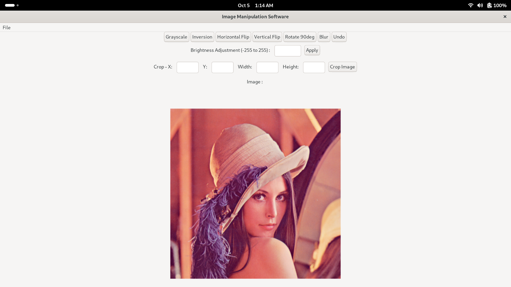
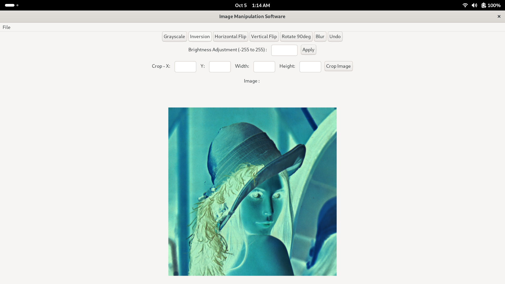
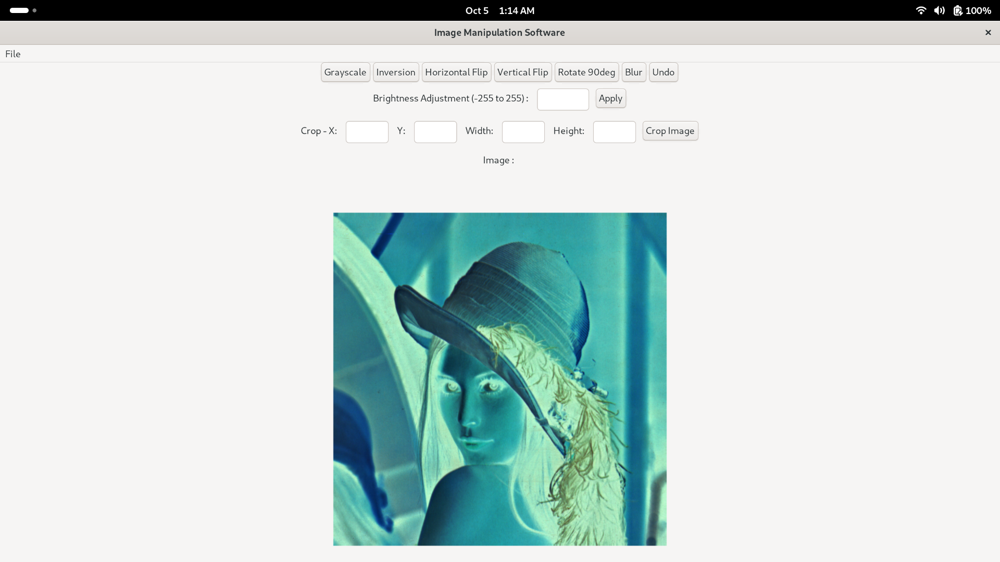
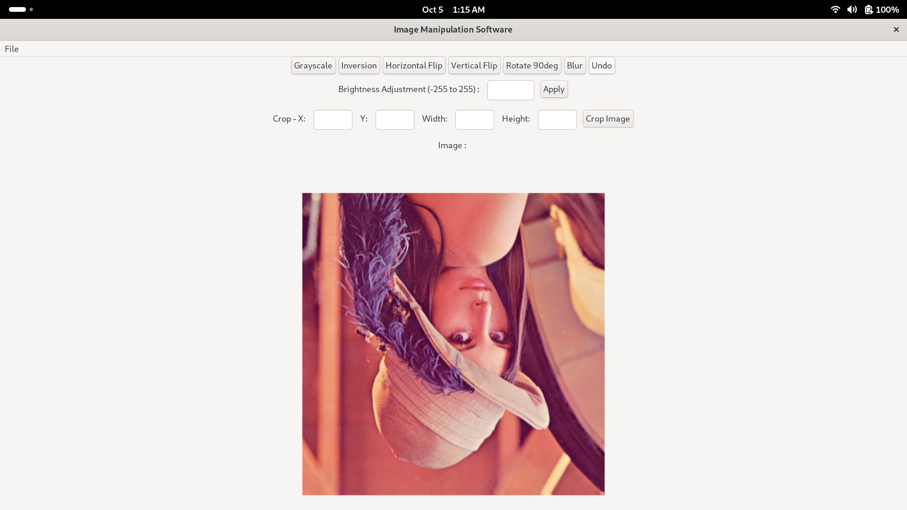
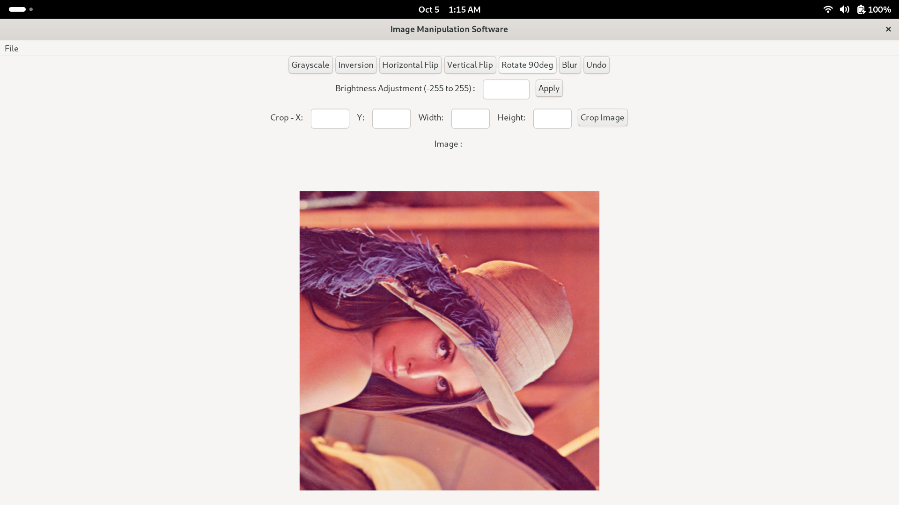
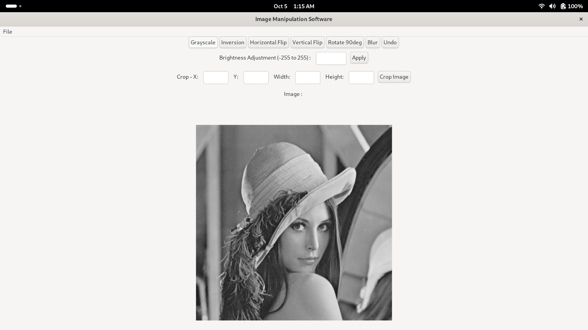
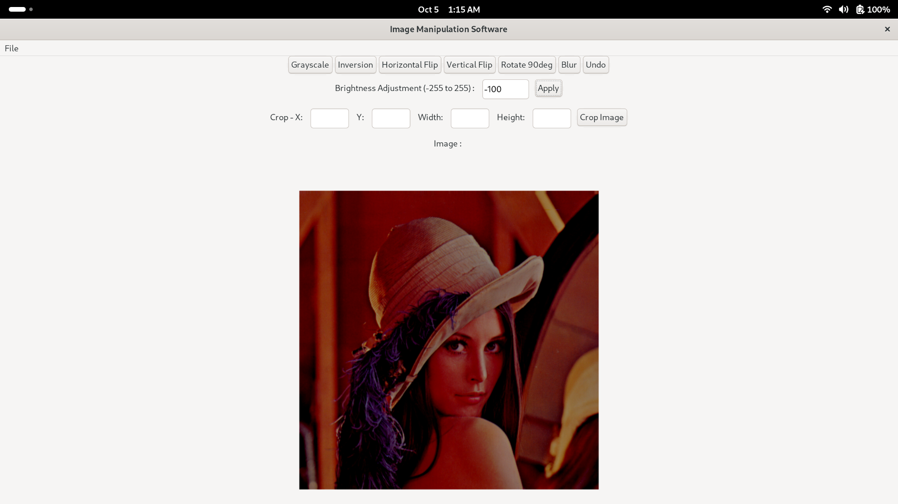
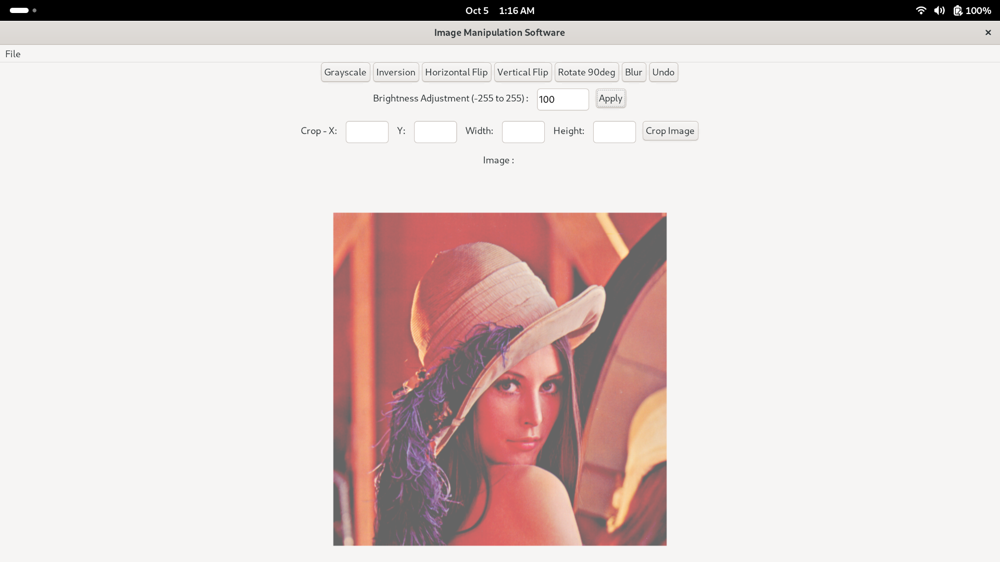
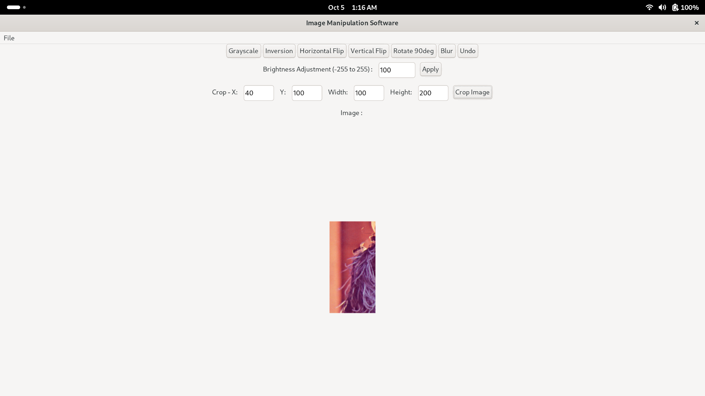

# 🎨 Image Manipulation Software in C


A graphical Image Manipulation Software built using the C programming language and the IUP toolkit. This application allows users to open 24-bit uncompressed BMP images, perform manual pixel manipulations (such as grayscale, blurring, cropping, and flipping), and save the modified results.

## 👨‍💻 Author

- **Name:** MD Toriqul Islam Topu
- **Course/ID:** [Final Lab Project]
- **GitHub:** [@Topu](https://github.com/topuiit1840)
- **Project Link:** [@Lab_Final_Project](https://github.com/topuiit1840/1st-semister-lab-final)
- **IUP Documentation:** [@IUP](https://www.tecgraf.puc-rio.br/iup/)

---

## ⚙️ System Requirements

Ensure your environment meets the following dependencies before building:

- **OS:** Ubuntu / Debian
- **Compiler:** `gcc` (version >= 14.2.0)
- **Version Control:** `git` (version >= 2.47.3)

---


## Screenshots












## 🚀 Setup & Installation

Run the following commands in your terminal to clone the repository, install the necessary system dependencies, and set up the isolated library environment.

```bash
# Clone the repo
git clone https://github.com/topuiit1840/1st-semister-lab-final.git
cd image_manipulation

# Install system dependencies
sudo apt update
sudo apt install build-essential libgtk-3-dev libx11-dev pkg-config

# Create isolated library directories
mkdir ./iup
mkdir ./im

# Extract precompiled libraries into the isolated folders
tar -zxvf iup-3.32_Linux515_64_lib.tar.gz -C ./iup
tar -zxvf im-3.15_Linux515_64_lib.tar.gz -C ./im

```
